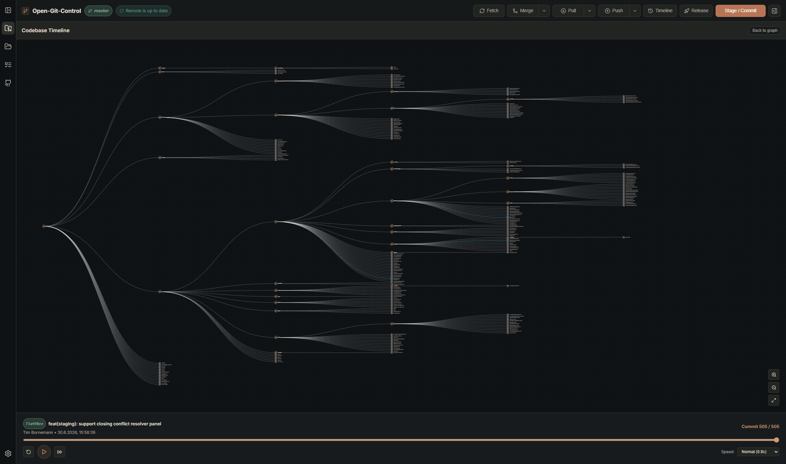
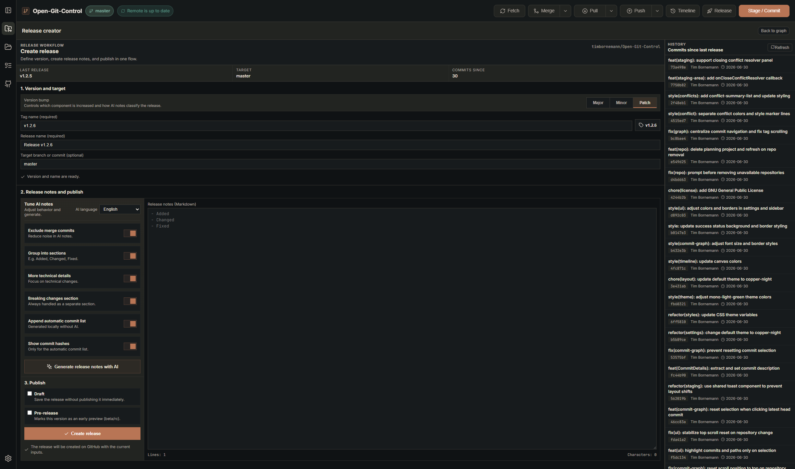
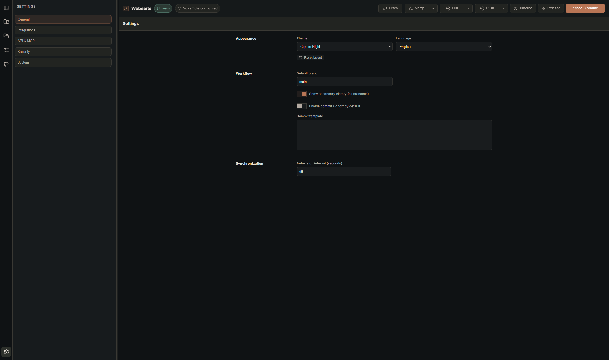

# Open-Git-Control

[](https://github.com/timbornemann/Open-Git-Control/actions/workflows/ci.yml)
[](https://github.com/timbornemann/Open-Git-Control/releases/latest)
[](LICENSE)

Open-Git-Control is a free, open-source desktop Git client for Windows, macOS, and Linux. It combines a visual commit graph, staging, a working-directory file browser and editor, diff inspection, conflict resolution, GitHub pull requests, releases, project planning, secret scanning, recovery tools, repository run workflows, and optional AI assistance in one local-first application.

Language: **English** | Deutsche Version: [README.de.md](README.de.md)


## Why Open-Git-Control?

Use Open-Git-Control when you want more than a minimal Git GUI, but still want a transparent, local-first alternative to commercial desktop clients.

- Free and open source under the GNU GPL license
- Git operations run locally against your repositories
- Visual commit graph with branch, tag, merge, reset, rebase, cherry-pick, revert, and recovery actions
- Staging, stash, hunk-based diffs, file history, blame, and conflict resolution in one workflow
- GitHub authentication, repository cloning/forking, pull requests, CI status, workflows, and release publishing
- Project planning board with local REST and MCP-style API for agent-assisted work
- Working-directory tree with safe in-app file previews and editing, plus native file-system actions when needed
- Per-repository Run workflows for test, format, start, and build commands with a live console
- Optional AI support through Ollama, Google Gemini, or OpenAI for commit messages, auto-commits, release notes, and planner hand-offs
- Secret scanning before commits and pushes, allowlists, safe prompts for dangerous operations, and local encrypted token storage when available

## Downloads

Always-current release page:

[github.com/timbornemann/Open-Git-Control/releases/latest](https://github.com/timbornemann/Open-Git-Control/releases/latest)

Current latest release: [v2.0.2](https://github.com/timbornemann/Open-Git-Control/releases/tag/v2.0.2), published 2026-07-19.

The badge and latest release page stay current automatically. The direct binary links below are versioned by GitHub asset name and are refreshed by the release workflow after a new stable release is published.

| Platform    | Package               | Direct GitHub download                                                                                                                                                 |
| ----------- | --------------------- | ---------------------------------------------------------------------------------------------------------------------------------------------------------------------- |
| Windows x64 | NSIS installer `.exe` | [Open-Git-Control-2.0.2-win-x64.exe](https://github.com/timbornemann/Open-Git-Control/releases/download/v2.0.2/Open-Git-Control-2.0.2-win-x64.exe)                     |
| Linux x64   | AppImage              | [Open-Git-Control-2.0.2-linux-x86_64.AppImage](https://github.com/timbornemann/Open-Git-Control/releases/download/v2.0.2/Open-Git-Control-2.0.2-linux-x86_64.AppImage) |
| Linux amd64 | Debian package `.deb` | [Open-Git-Control-2.0.2-linux-amd64.deb](https://github.com/timbornemann/Open-Git-Control/releases/download/v2.0.2/Open-Git-Control-2.0.2-linux-amd64.deb)             |
| macOS x64   | Disk image `.dmg`     | [Open-Git-Control-2.0.2-mac-x64.dmg](https://github.com/timbornemann/Open-Git-Control/releases/download/v2.0.2/Open-Git-Control-2.0.2-mac-x64.dmg)                     |
| macOS x64   | Zip archive           | [Open-Git-Control-2.0.2-mac-x64.zip](https://github.com/timbornemann/Open-Git-Control/releases/download/v2.0.2/Open-Git-Control-2.0.2-mac-x64.zip)                     |

The `latest*.yml` and `.blockmap` files in GitHub Releases are update metadata for the auto-updater. Most users should download one of the installers above.

## Requirements

- Git must be installed and available in your `PATH`.
- GitHub CLI (`gh`) is optional and only required for the one-click GitHub login method.
- Ollama, a Gemini API key, or an OpenAI API key is optional and only required for AI features.
- Development from source requires Node.js and npm. CI currently uses Node.js 20.

## Screenshots

### Repository cockpit and commit graph


### Diff viewer with hunk actions, blame, and file inspector


### Conflict resolver


### Codebase timeline



### Project planning board


### Release creator



### Settings



## Table of Contents

- [Why Open-Git-Control?](#why-open-git-control)
- [Downloads](#downloads)
- [Requirements](#requirements)
- [Screenshots](#screenshots)
- [Feature Reference](#feature-reference)
- [Typical Workflows](#typical-workflows)
- [Local Planning API and MCP](#local-planning-api-and-mcp)
- [Install Git](#install-git)
- [Repository Run Commands](#repository-run-commands)
- [Development](#development)
- [Release Builds](#release-builds)
- [Data Storage and Security](#data-storage-and-security)
- [Troubleshooting](#troubleshooting)
- [Contributing and Support](#contributing-and-support)
- [License](#license)

## Feature Reference

### Repository and Workspace Management

- Open local repositories and set the active working session.
- Initialize folders that are not yet Git repositories with `git init`, optionally including a starter README and license.
- Keep a persistent repository workspace with recent repositories, favorites, active repository, and sorting.
- Restore stored repositories without an empty-state flash: the active repository is prepared first while the remaining entries are validated in the background.
- Search and sort local repositories by last opened date, name, creation date, ascending, or descending order.
- Pin repositories, close repositories, and switch between known repositories quickly.
- Detect unavailable repositories and handle missing repository paths gracefully.
- Reveal a repository folder directly from Local Repositories or the active repository header.
- Detect an existing `LICENSE`/`LICENCE` file and add or replace a license from bundled, auditable SPDX/Choose a License templates. Required copyright, program-name, program-description, and Apache/GNU notice fields are collected before writing.
- Reset stored layout dimensions from settings.
- Resize the main sidebar and the graph/inspector split.
- Persist collapsed sidebar panels per repository for remotes, branches, tags, and submodules.

### Branches, Remotes, Tags, and Submodules

- List local and remote branches with search/filtering.
- Create branches, check out local branches, rename branches, and delete branches.
- Force-delete unmerged branches only after an explicit confirmation.
- Create branches from the graph and from selected commits.
- Merge branches from the topbar or context menu with:
  - default merge
  - no-fast-forward merge
  - squash merge
  - fast-forward-only merge
- Fetch all remotes with pruning and tags.
- Auto-fetch on a configurable interval and refresh when the app becomes visible again.
- Show remote health states:
  - no remote configured
  - no tracking branch
  - local ahead
  - remote ahead
  - diverged
  - up to date
  - fetch error
- Add, remove, rename, and update remote URLs.
- Set upstream for the current branch.
- Handle missing GitHub remotes by removing invalid `origin` mappings and returning the repo to local/offline mode.
- Create lightweight or annotated tags.
- Search, select, delete, and push tags.
- Show recursive submodule status.
- Run `git submodule update --init --recursive`.
- Run `git submodule sync --recursive`.
- Open submodules in the file system.

### Topbar Git Actions

- Fetch.
- Merge selected branch with selectable merge mode.
- Pull with:
  - default pull
  - pull with rebase
  - no-fast-forward pull
  - fast-forward-only pull
- Push with:
  - default push
  - set upstream (`-u`)
  - force-with-lease
  - push tags
- Run repository-specific Run, Test, Format, Start, and Build workflows.
- Open the codebase timeline.
- Open the release creator.
- Open the staging/commit panel.
- Access compact "more actions" variants when the window is narrow.

### Commit Graph and History

- Visual commit graph with branch and merge topology.
- Paged commit loading for larger histories.
- Working tree row above history with staged, unstaged, and untracked counts.
- Async commit statistics for files, additions, and deletions.
- Search commits by:
  - all fields
  - subject
  - author
  - hash
  - refs
- Navigate search matches forward/backward.
- Select commits and inspect changed files, commit body, file history, blame, and patch.
- Commit context menu actions:
  - checkout as new branch
  - detached checkout
  - create branch
  - create tag
  - cherry-pick
  - revert
  - revert merge commit with `-m 1`
  - reset `--soft`
  - reset `--mixed`
  - reset `--hard`
  - interactive rebase with editable todo list
  - merge selected ref into current branch
  - copy commit hash
- Tag selection jumps to the tagged commit.

### Codebase Timeline

- Timeline view reconstructs repository file changes over commit history.
- Canvas-based file tree visualization.
- Highlights added, modified, deleted, and renamed files.
- Playback controls:
  - play/pause
  - reset to start
  - skip to end
  - timeline slider
  - speed selector from very slow to very fast
- Shows active commit hash, author, date, subject, and current position in the history.

### Forensic Search and Recovery

- Run forensic history searches directly from the graph:
  - string search with `git log -S`
  - regex search with `git log -G`
  - line range search with `git log -L`
- Use path suggestions from the working tree and repository history.
- Inspect result commits and jump into diffs.
- Recovery Center based on reflog:
  - filter reflog entries
  - inspect lost or moved commits
  - create a recovery branch from a reflog entry
  - detached checkout
  - hard reset with explicit danger confirmation

### Staging Area, Stash, and Commits

- Working directory panel with sections for:
  - conflicts
  - staged files
  - unstaged files
  - untracked files
- Search changed files.
- Show staged and unstaged file statistics.
- Stage and unstage individual files.
- Stage all and unstage all.
- Stage all untracked files.
- Discard individual files or all changes.
- Delete untracked files.
- Add files, folders, top-level folders, or file-type patterns to `.gitignore`.
- Stash with optional message.
- Apply, pop, and drop stashes.
- Create a branch from a stash.
- Commit with title and optional description.
- Commit with `--amend`.
- Commit with `--signoff`.
- Enable commit signoff by default in settings.
- Use a configurable commit template.
- Commit with `Ctrl+Enter` in commit fields.

### Working Directory and File Viewer

- Switch the right inspector between the Staging Area and a repository-bound Working Directory tree.
- Browse visible files and folders without exposing `.git` or other dot entries; expanded folders stay open while switching views and load lazily.
- File and folder context actions: open, rename, cut, copy, paste, delete, reveal in the system file manager, open externally, or choose an application. Copy/cut/paste stays inside the active repository and destructive actions require confirmation.
- Open files in the main pane instead of the graph:
  - editable syntax-highlighted text with explicit save and `Ctrl/Cmd+S`
  - Markdown editor and preview
  - safe image and SVG previews
  - sandboxed HTML/HTM preview
  - file History and Blame tabs
  - safe information view for binary or oversized files, with system-open actions

### Diff Viewer and File Inspector

- Open staged, unstaged, and commit-specific diffs.
- Unified and side-by-side diff modes.
- Syntax-style highlighting for common code tokens.
- Hunk navigation with current hunk counter.
- Hunk actions:
  - stage hunk
  - unstage hunk
  - discard hunk
- Blame overlay inside the diff viewer.
- Click blame entries to navigate to the responsible commit.
- File inspector tabs:
  - History
  - Blame
  - Patch
- File history lists previous commits for the selected file.
- Blame loads in chunks and can load additional 500-line pages.
- Patch tab opens the diff in the main pane.
- Large diff protection:
  - byte and line limits
  - truncated rendering
  - full-copy action where available
- Binary file detection for common binary extensions and Git binary patches.

### Conflict Resolver

- Dedicated conflict resolver view for merge and rebase conflicts.
- Opens automatically when conflicts are detected.
- Shows conflict file list and conflict block navigation.
- Side-by-side current/incoming conflict blocks.
- Resolve one block at a time:
  - accept current
  - accept incoming
  - take both versions
- Resolve all blocks:
  - accept all current
  - accept all incoming
- Manual editor with conflict marker and line-gutter feedback.
- Reload file from disk.
- Save edits.
- Save and mark as resolved.
- Discard changes.
- Continue or abort merge.
- Continue or abort rebase.
- Prevent commits while unresolved conflicts remain.

### GitHub Integration

- Authenticate with:
  - Personal Access Token
  - OAuth Device Flow
  - one-click login through GitHub CLI (`gh`)
- Reconnect from saved GitHub session.
- Log out and clear saved auth.
- Configure GitHub OAuth Client ID for Device Flow.
- Configure GitHub host for GitHub Enterprise style hosts.
- List GitHub repositories with search, pagination, and refresh.
- Detect whether GitHub repositories are already cloned locally.
- Clone GitHub repositories with progress modal.
- Clone any HTTP, HTTPS, or SSH Git remote URL.
- Fork a GitHub repository by URL and clone the fork locally.
- Create a new GitHub repository from a local repo without `origin`.
- Connect the created GitHub repo as `origin`.
- Replace invalid remote mapping when the upstream repository no longer exists.

### Pull Requests, CI, and Workflows

- Pull request list for the active GitHub repository.
- Filter PRs by open, closed, or all.
- Create pull requests with title, body, head branch, and base branch.
- Open PRs in the browser.
- Copy PR URLs.
- Check out PR branches locally.
- Merge PRs with:
  - merge commit
  - squash
  - rebase
- CI evaluation per PR:
  - success
  - failure
  - pending
  - neutral
  - unknown
- Show workflow runs and status checks.
- Show recent GitHub Actions workflow runs for the current branch.
- Filter workflow runs and open them in the browser.

### Release Creator

- Dedicated release view from the topbar.
- Reads GitHub release context:
  - repository URL
  - existing tags
  - latest release tag
  - commits since latest release
  - target branch or commit
- Suggests the next semantic version tag.
- Choose version bump:
  - major
  - minor
  - patch
- Configure:
  - tag name
  - release name
  - target commitish
  - release body in Markdown
  - draft flag
  - prerelease flag
- Generate release notes with AI.
- Tune AI notes:
  - language English/German
  - exclude merge commits
  - group into sections
  - more technical details
  - breaking changes section
  - append automatic commit list
  - show commit hashes
- Publish the release directly to GitHub.

### Project Planning

- Planning view for repository-backed projects and future projects.
- Board columns:
  - Idea
  - Bug
  - Planned
  - In progress
  - Blocked
  - Done
- Planning items support:
  - title
  - description
  - priority
  - status
  - tags
- Filter planning items by search, priority, status, and tag.
- Create, edit, move, and delete planning items.
- Create future projects without a Git repository.
- Edit or delete projects.
- Materialize a future project by selecting a parent directory, creating a project folder, running `git init`, and keeping the planning project linked.
- Repository removal can also remove linked planning items after confirmation.
- Context menus on planning items offer quick status/priority changes, delete, agent-prompt copy, and (for repository projects) AI commit-message generation.
- Copy an agent-ready implementation prompt for one item or every currently visible item in a status column. Column prompts keep the visible order sorted by priority.
- Generate an AI commit message from one item or a visible status column. The result is saved as the repository commit draft and opens the staging view.

### Local Planning API and MCP

- Local HTTP server bound to `127.0.0.1`.
- Preferred port: `2990`; if occupied, the app uses the next available local port.
- API docs: `http://127.0.0.1:2990/api/`
- OpenAPI JSON: `/api/openapi.json`
- MCP JSON-RPC endpoint: `/mcp`
- REST wrapper for MCP-style tools:
  - `GET /api/mcp/tools`
  - `POST /api/mcp/tools/call`
- All data and MCP endpoints require a token.
- Public health and docs endpoints are available without protected data.
- Token can be sent as:
  - `x-open-git-control-token: <TOKEN>`
  - `Authorization: Bearer <TOKEN>`
- Settings show:
  - API status
  - host
  - port
  - base URL
  - API docs URL
  - OpenAPI URL
  - MCP URL
  - token header
  - current token
  - token source
  - token expiry
- Generate persistent API tokens for:
  - 1 day
  - 1 month
  - 1 year
  - forever
- Persistent API tokens are stored with Electron `safeStorage` when OS encryption is available.
- Temporary session tokens are used when no persistent token exists.
- Environment controls:
  - `OPEN_GIT_CONTROL_API_PORT=2990`
  - `OPEN_GIT_CONTROL_API_DISABLED=true`
  - `OPEN_GIT_CONTROL_API_TOKEN=<TOKEN>`
- REST planning endpoints include:
  - `GET /api/health`
  - `GET /api/projects`
  - `POST /api/projects`
  - `GET/PATCH/DELETE /api/projects/:projectId`
  - `GET/POST /api/projects/:projectId/todos`
  - `GET /api/repositories`
  - `POST /api/repositories/ensure`
  - `GET /api/repositories/todos`
  - `GET/POST /api/todos`
  - `GET /api/todos/next`
  - `GET/PATCH/DELETE /api/todos/:todoId`
  - `POST /api/todos/:todoId/move`
  - `GET /api/tabs`
  - `GET/POST /api/tabs/:tab/todos`
  - `GET /api/agent/next`
- MCP-style tools:
  - `list_tabs`
  - `list_projects`
  - `list_repositories`
  - `list_todos`
  - `get_next_todos`
  - `create_project`
  - `ensure_repository_project`
  - `create_todo`
  - `update_todo`
  - `move_todo`
  - `delete_todo`
- Git and GitHub operations are deliberately not exposed through the local API or MCP surface.

### AI Assistance

- Providers:
  - Ollama
  - Google Gemini
  - OpenAI
- Configure Ollama base URL.
- Store, replace, and remove Gemini API key securely when OS encryption is available.
- Test provider connection.
- Load available models.
- Select or type a model manually.
- Configure commit-message style:
  - Conventional Commits
  - plain
  - detailed
- Configure AI output language for commit messages and planner prompts:
  - auto
  - German
  - English
- Generate an AI commit message from user notes or repository-backed planner items.
- Copy status-aware AI agent prompts for planner implementation, bug fixing, continuation, unblocking, or completion review.
- AI auto-commit:
  - analyzes the working tree
  - groups changed files logically
  - creates commit messages
  - commits groups automatically
  - reports phases such as snapshot, grouping, committing, retry, fallback, done, failed, and cancelled
  - can be cancelled
- AI release notes from commit history and release context.

### Security and Safety

- Optional confirmation prompts for dangerous Git operations.
- Explicit danger confirmations for destructive reset, discard, delete, force-delete, and similar actions.
- Git command policy limits what the renderer can ask the main process to run.
- External link policy opens allowed URLs through the main process.
- Diff preview policy normalizes safe diff commands.
- Secret scan before commit and push:
  - scans staged diffs locally before a commit and scans the push range again before push
  - can include tags
  - supports cancellation
  - reports findings with rule, severity, file, line, and sanitized context
  - uses app-native dialogs to cancel, continue, or add affected files to the allowlist
  - formats GitHub Push Protection rejections into an actionable dialog with the relevant links and remediation guidance
- Secret scan strictness:
  - low
  - medium
  - high
- Secret scan allowlist formats:
  - `path:...`
  - `regex:...`
  - plain text
  - comment lines with `#`
- GitHub token, Gemini key, and persistent Planning API token are stored OS-encrypted through Electron `safeStorage` when available.
- If OS encryption is unavailable, secrets are not stored persistently.

### Settings, Updates, and Job Center

- General settings:
  - theme
  - language
  - default branch
  - layout reset
  - secondary history
  - commit signoff default
  - commit template
  - auto-fetch interval
- Themes:
  - Copper Night
  - Midnight Teal
  - Graphite Blue
  - Forest Copper
  - Porcelain Light
  - Ember Slate
  - Arctic Mint
  - Mono Dark Red
  - Mono Light Red
  - Mono Dark Green
  - Mono Light Green
- Integrations settings:
  - GitHub OAuth Client ID
- AI & MCP settings:
  - AI provider
  - AI model
  - AI message style/language
  - Ollama URL
  - Gemini API key
  - OpenAI API key and HTTPS base URL
  - runtime API status
  - copyable URLs and token values
  - token generation and deletion
  - example cURL commands
  - example MCP server config
- Security settings:
  - dangerous operation confirmations
  - secret scan before commit
  - secret scan before push
  - strictness
  - allowlist
- System settings:
  - installed app version
  - updater status
  - available version
  - download progress
  - background update toggle
  - one-click update
  - release notes
  - job center
- Run settings:
  - per-repository `.Open-Git-Control/run.json` configuration
  - platform-specific shell commands and ordered workflow steps
  - recognised command templates and output parser selection
- Job Center tracks recent operations such as:
  - clone
  - fetch
  - pull
  - push
  - stage
  - commit
  - stash branch
  - secret scan
  - AI auto-commit

### Shortcuts and Productivity

- `Ctrl+1..4`: switch main sidebar tabs
- `Ctrl+Shift+F`: fetch
- `Ctrl+Shift+P`: command palette
- `Ctrl+Shift+T`: create a todo for the active repository
- `Ctrl+Enter`: commit from commit fields
- Command palette with keyboard navigation, search, `Enter` to run, and `Esc` to close
- Copy buttons for hashes, URLs, tokens, API examples, and PR links
- Virtualized lists for larger file and commit detail views

## Typical Workflows

### Open or initialize a repository

1. Open the Local Repositories tab.
2. Choose a folder.
3. If it is not a Git repository yet, confirm initialization.
4. Switch to the Repository tab and start working.

### Standard local Git workflow

1. Fetch or pull from the topbar.
2. Create or switch a branch.
3. Review changed files in the working directory.
4. Open diffs, stage files or hunks, and optionally stash work.
5. Create a commit with title and description.
6. Push, set upstream, push tags, or force-with-lease when needed.

### Resolve conflicts

1. Start a merge, pull, rebase, cherry-pick, or other operation that produces conflicts.
2. Open the Conflict Resolver when it appears.
3. Resolve each block by choosing current, incoming, or both.
4. Use the manual editor when the result needs fine-tuning.
5. Save and mark files as resolved.
6. Continue or abort merge/rebase from the resolver.

### GitHub pull request flow

1. Sign in through PAT, Device Flow, or GitHub CLI one-click login.
2. Make sure `origin` points to a GitHub repository.
3. Create a pull request from the repo sidebar.
4. Inspect PR CI and workflow status.
5. Open, copy, checkout, merge, squash, or rebase the PR.

### Release flow

1. Open Release from the topbar.
2. Refresh release context.
3. Pick major, minor, or patch.
4. Adjust tag, release name, target, and Markdown body.
5. Optionally generate AI release notes.
6. Publish as a normal release, draft, or prerelease.

### Recovery flow

1. Open Recovery Center in the graph area.
2. Filter reflog entries.
3. Create a recovery branch from the relevant entry.
4. Use detached checkout or hard reset only when you are sure.

### Agent planning workflow

1. Start Open-Git-Control.
2. Open Settings -> AI & MCP and copy the MCP URL plus token.
3. Configure an external agent with the MCP URL or REST endpoints.
4. Ask the agent for `get_next_todos` or `GET /api/agent/next`.
5. Let the agent create or move planning items.
6. Keep Git and GitHub operations inside the desktop app.

## Local Planning API and MCP

Example: get next todos for a repository.

```bash
curl "http://127.0.0.1:2990/api/agent/next?repoPath=<REPO_PATH_URL_ENCODED>&limit=10" \
  -H "x-open-git-control-token: <TOKEN>"
```

Example: list MCP-style tools over JSON-RPC.

```bash
curl -X POST "http://127.0.0.1:2990/mcp" \
  -H "x-open-git-control-token: <TOKEN>" \
  -H "content-type: application/json" \
  -d "{\"jsonrpc\":\"2.0\",\"id\":1,\"method\":\"tools/list\"}"
```

Example MCP server config:

```json
{
  "mcpServers": {
    "open-git-control": {
      "type": "http",
      "url": "http://127.0.0.1:2990/mcp",
      "headers": {
        "x-open-git-control-token": "<TOKEN>"
      }
    }
  }
}
```

## Install Git

Git must be installed and available in your `PATH`.

### Windows

1. Download Git from [git-scm.com/downloads](https://git-scm.com/downloads).
2. Run the Windows installer.
3. Keep "Git from the command line" enabled.
4. Restart your terminal or computer if `git` is not found immediately.

### macOS

Homebrew:

```bash
brew install git
```

Apple Command Line Tools:

```bash
xcode-select --install
```

### Linux

Debian/Ubuntu:

```bash
sudo apt update && sudo apt install git -y
```

Fedora:

```bash
sudo dnf install git -y
```

Arch:

```bash
sudo pacman -S git
```

### Verify Git

```bash
git --version
git config --global user.name "Your Name"
git config --global user.email "your@email.com"
```

## Repository run commands

The **Run** menu in the top bar can run repository-specific **Run**, **Test**, **Format**, **Start**, and **Build** commands. Configuration is versioned in `.Open-Git-Control/run.json`; commands execute only after an explicit click and always use the repository root as their working directory.

```json
{
  "version": 1,
  "actions": {
    "test": {
      "steps": [
        {
          "id": "unit-tests",
          "label": "Unit tests",
          "parser": "vitest-jest",
          "windows": { "shell": "powershell", "command": "npm test" },
          "macos": { "shell": "zsh", "command": "npm test" },
          "linux": { "shell": "bash", "command": "npm test" }
        }
      ]
    }
  }
}
```

Use **Settings -> Run** to edit the five fixed actions, select recognised templates, and configure ordered workflows. Templates cover npm, pnpm, Yarn, Bun, Python, Rust, Go, .NET, Maven, Gradle, Flutter, and CMake projects. Each step can use PowerShell or CMD on Windows, zsh on macOS, and bash on Linux.

Only one workflow runs at a time. It can continue in the background, be reopened from the Run menu, and be stopped from the app. The console keeps a bounded raw-output buffer, a parsed Problems tab, a Summary tab, and copy actions for both output and problems. An unread successful result turns the Run button green; an unread failed result turns it red until opened.

## Development

Install dependencies:

```bash
npm install
```

Run Vite and Electron in development:

```bash
npm run dev
```

Build the application:

```bash
npm run build
```

Run tests:

```bash
npm run test
npm run test:coverage
npm run test:ci
```

Available scripts:

| Script                   | Purpose                                                  |
| ------------------------ | -------------------------------------------------------- |
| `npm run dev`            | Run Vite and Electron together                           |
| `npm run electron:dev`   | Build Electron process and start Electron against Vite   |
| `npm run build`          | TypeScript, Vite build, and Electron process build       |
| `npm run build:electron` | Compile Electron main/preload process                    |
| `npm run legal:prepare`  | Generate installer license and third-party notices       |
| `npm run legal:check`    | Verify generated legal files are current                 |
| `npm run dist`           | Build packaged app for the current platform              |
| `npm run dist:win`       | Build Windows NSIS x64 package                           |
| `npm run dist:linux`     | Build Linux AppImage and deb packages                    |
| `npm run dist:mac`       | Build macOS dmg and zip packages                         |
| `npm run release:win`    | Build unsigned Windows release assets without publishing |
| `npm run release:linux`  | Build Linux release assets without publishing            |
| `npm run release:mac`    | Build unsigned macOS release assets without publishing   |
| `npm run preview`        | Preview Vite build                                       |
| `npm run electron:start` | Start Electron after the Electron process has been built |
| `npm run test`           | Run unit tests                                           |
| `npm run test:coverage`  | Run tests with coverage                                  |
| `npm run test:ci`        | Compile, test with coverage, and build                   |

## Release Builds

Local package artifacts are written to `release/`.

```bash
npm run dist
npm run dist:win
npm run dist:linux
npm run dist:mac
```

GitHub publishing is handled by [.github/workflows/release.yml](.github/workflows/release.yml). Publishing a release with a tag such as `vX.Y.Z` in Open Git Control or on GitHub triggers quality gates and platform builds for Windows, Linux, and macOS. The workflow derives the package and lockfile version from the release tag, generates legal notices, validates the packaged applications and updater metadata, and generates `SHA256SUMS.txt`. It then attaches all assets to the already published release and verifies them remotely. The workflow can also be started manually for an existing release tag to retry failed builds.

Local `dist:*` builds use the version committed in `package.json`. Official release builds run `prepare-release-version.js` so `package.json`, `package-lock.json`, the packaged app version, and MCP server metadata all resolve to the release tag version.

No custom repository secrets or signing certificates are required. GitHub supplies the workflow's `GITHUB_TOKEN` automatically. Windows and macOS packages are intentionally unsigned and the macOS build is not notarized, so operating systems can show SmartScreen or Gatekeeper warnings. Code signing and notarization can be added later without changing the release trigger.

Expected release assets:

- `Open-Git-Control-<version>-win-x64.exe`
- `Open-Git-Control-<version>-linux-x86_64.AppImage`
- `Open-Git-Control-<version>-linux-amd64.deb`
- `Open-Git-Control-<version>-mac-x64.dmg`
- `Open-Git-Control-<version>-mac-x64.zip`
- updater metadata such as `latest.yml`, `latest-linux.yml`, `latest-mac.yml`, and blockmaps
- `SHA256SUMS.txt` for manually downloaded installers and archives
- bundled `LICENSE` and `THIRD_PARTY_NOTICES.txt` resources

## Data Storage and Security

- Git commands operate on the selected local repository.
- Repository workspace state is stored in the Electron user-data directory.
- Settings are stored locally.
- Planning projects and planning items are stored locally.
- The Planning API binds to `127.0.0.1`.
- Planning API token-protected endpoints are intended for local processes on the same machine.
- GitHub token, Gemini key, and persistent Planning API token are stored with OS-backed encryption through Electron `safeStorage` when available.
- If OS encryption is unavailable, secrets are not persisted.
- The local API exposes planning data only; it does not expose Git or GitHub actions.

## Troubleshooting

### `git` not found

- Install Git.
- Restart your terminal or computer.
- Verify with `git --version`.

### GitHub one-click login does not work

- Install GitHub CLI from [cli.github.com](https://cli.github.com/).
- Verify with `gh --version`.
- Use PAT or Device Flow if you do not want to use GitHub CLI.

### Device Flow does not work

- Set a GitHub OAuth Client ID in Settings -> Integrations.
- Alternatively set `GITHUB_OAUTH_CLIENT_ID` before starting the app.

### No pull requests are visible

- Make sure `origin` points to a GitHub repository.
- Sign in to GitHub in the GitHub tab.
- Refresh the repository and PR panel.

### Commit or push is blocked by secret scan

- Inspect the reported file and line.
- Remove the secret or rotate it if it was committed accidentally.
- Use the dialog's allowlist action only for intentional test or example values; it allowlists the affected file path for future scans.
- Add a narrow allowlist rule only for intentional dummy/example values.

### Auto-update is unavailable

- Auto-update only works in installed production builds.
- `npm run dev` and local unpackaged builds do not use the updater.

### Planning API is not on port `2990`

- Another local process may already use the port.
- Check Settings -> AI & MCP for the actual port.
- Set `OPEN_GIT_CONTROL_API_PORT=<PORT>` before starting the app if you want a different preferred port.

### AI features do not respond

- For Ollama, verify the Ollama server URL and model name.
- For Gemini, store a valid API key and select a supported model.
- Use "Test connection" and "Load models" in Settings -> Integrations.

## Contributing and Support

Open-Git-Control uses structured GitHub forms for bug reports, feature requests, questions, and documentation reports:

[Open a structured issue](https://github.com/timbornemann/Open-Git-Control/issues/new/choose)

- Read [CONTRIBUTING.md](CONTRIBUTING.md) before opening a pull request.
- Use [SUPPORT.md](SUPPORT.md) to choose the right report or question path.
- Report security vulnerabilities privately through [SECURITY.md](SECURITY.md), not in public issues.
- Follow the [Code of Conduct](CODE_OF_CONDUCT.md) when participating in issues, reviews, and pull requests.

Blank issues are disabled so new reports include enough context to be triaged.

## License

Open-Git-Control is licensed under the [GNU General Public License](LICENSE).
