# Open-Git-Control

[](https://github.com/timbornemann/Open-Git-Control/actions/workflows/ci.yml?query=branch%3Amaster+event%3Apush)
[](https://github.com/timbornemann/Open-Git-Control/releases/latest)
[](LICENSE)

Open-Git-Control is a free, open-source desktop Git client for Windows, macOS, and Linux. It combines a visual commit graph, staging, a working-directory file browser and editor, diff inspection, conflict resolution, offline repository analytics, hosting-provider pull/merge requests, guided repository publishing, releases, project planning, secret scanning, recovery tools, repository run workflows, and optional AI assistance in one local-first application.

Language: **English** | Deutsche Version: [README.de.md](README.de.md)

Git is required; Git LFS and GitHub CLI are optional. The app checks these tools and offers official downloads or installation through an existing package manager under **Settings → App & diagnostics → System tools**. See [tool setup](Docs/SYSTEM_TOOLS.md).

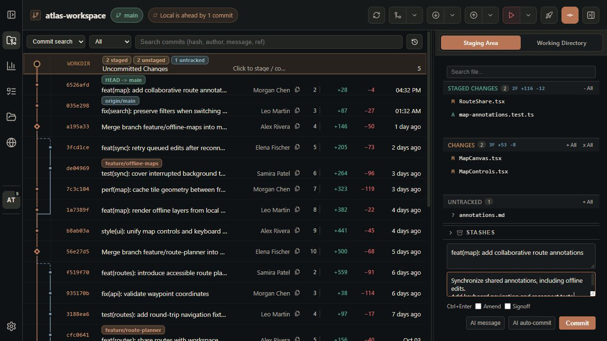

## Why Open-Git-Control?

Use Open-Git-Control when you want more than a minimal Git GUI, but still want a transparent, local-first alternative to commercial desktop clients.

- Free and open source under the GNU GPL license
- Git operations run locally against your repositories
- Visual commit graph with branch, tag, merge, reset, rebase, cherry-pick, revert, and recovery actions
- Staging, stash, hunk-based diffs, file history, blame, and conflict resolution in one workflow
- Offline repository analytics: activity, language distribution, change hotspots, code churn, file-coupling networks, release comparisons and timeline playback
- GitHub, Forgejo, GitLab, Bitbucket Cloud and Data Center accounts, repository catalogs, cloning/forking, PRs/MRs, CI and provider-specific publishing
- Guided **Publish repository** flow to create a hosting repository, connect it and upload selected branches and tags
- Independent pull sources, hosting targets, and saved multi-endpoint push profiles with per-target results
- Project planning board with local REST and MCP-style API for agent-assisted work
- Working-directory tree with safe in-app file previews and editing, plus native file-system actions when needed
- Per-repository Run workflows with structured console output, detected problems and clickable file references that open the in-app editor
- Optional AI support through Ollama, Google Gemini, or OpenAI for commit messages, auto-commits, release notes, and planner hand-offs
- Secret scanning before commits and pushes, versioned repository allowlists, safe prompts for dangerous operations, and local encrypted token storage when available
- Guided Git installation, commit identity setup and recovery of moved repositories

## Downloads

Always-current release page:

[github.com/timbornemann/Open-Git-Control/releases/latest](https://github.com/timbornemann/Open-Git-Control/releases/latest)

Current latest release: [v2.2.1](https://github.com/timbornemann/Open-Git-Control/releases/tag/v2.2.1), published 2026-10-02.

The badge and latest release page stay current automatically. The direct binary links below are versioned by GitHub asset name and are refreshed by the release workflow after a new stable release is published.

| Platform    | Package               | Direct GitHub download                                                                                                                                                 |
| ----------- | --------------------- | ---------------------------------------------------------------------------------------------------------------------------------------------------------------------- |
| Windows x64 | NSIS installer `.exe` | [Open-Git-Control-2.2.1-win-x64.exe](https://github.com/timbornemann/Open-Git-Control/releases/download/v2.2.1/Open-Git-Control-2.2.1-win-x64.exe)                     |
| Linux x64   | AppImage              | [Open-Git-Control-2.2.1-linux-x86_64.AppImage](https://github.com/timbornemann/Open-Git-Control/releases/download/v2.2.1/Open-Git-Control-2.2.1-linux-x86_64.AppImage) |
| Linux amd64 | Debian package `.deb` | [Open-Git-Control-2.2.1-linux-amd64.deb](https://github.com/timbornemann/Open-Git-Control/releases/download/v2.2.1/Open-Git-Control-2.2.1-linux-amd64.deb)             |
| macOS x64   | Disk image `.dmg`     | [Open-Git-Control-2.2.1-mac-x64.dmg](https://github.com/timbornemann/Open-Git-Control/releases/download/v2.2.1/Open-Git-Control-2.2.1-mac-x64.dmg)                     |
| macOS x64   | Zip archive           | [Open-Git-Control-2.2.1-mac-x64.zip](https://github.com/timbornemann/Open-Git-Control/releases/download/v2.2.1/Open-Git-Control-2.2.1-mac-x64.zip)                     |

The `latest*.yml` and `.blockmap` files in GitHub Releases are update metadata for the auto-updater. Most users should download one of the installers above.

## Requirements

- Git must be installed and executable. The app checks the process `PATH` and common installation locations; missing Git opens a setup dialog and leaves a sidebar warning until a successful recheck.
- Git LFS is optional, but required for LFS content and transfers. Git for Windows normally includes it; availability is still checked separately.
- GitHub CLI (`gh`) is optional and only required to import an existing GitHub CLI login.
- Ollama, a Gemini API key, or an OpenAI API key is optional and only required for AI features.
- Development from source requires Node.js and npm. CI currently uses Node.js 22.

## Screenshots

These are fresh browser captures of the actual app UI, using fictional Atlas projects, accounts and team activity in the **Copper Night** theme. They show the current source checkout; some features may be newer than the packaged release linked above.

The current repository and staging view is shown above. These main areas cover the rest of the app's everyday workflow.

### Local repository workspace

Find saved projects, pin favorites, see the active repository and open or clone a project from one place.

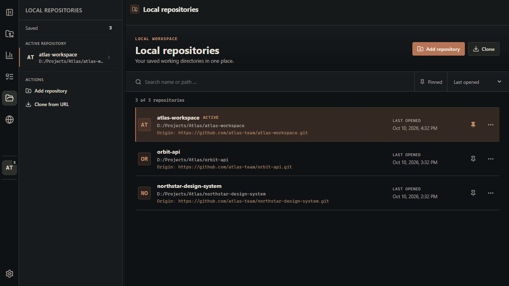

### Hosting across providers

Browse repositories across accounts and servers, identify local clones, and reach repository creation or publication directly from the catalog.

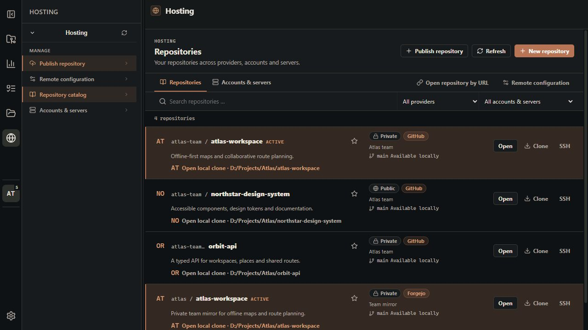

### Offline statistics and change hotspots

Activity, language distribution and a directory-based hotspot map share one compact overview. Filters live in the analytics sidebar.

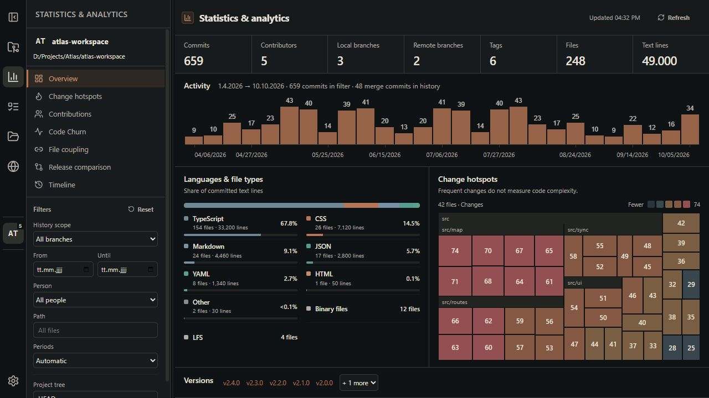

### Planning that travels with the repository

Turn ideas, bugs and implementation work into a shared board backed by `.Open-Git-Control/planning.json`.

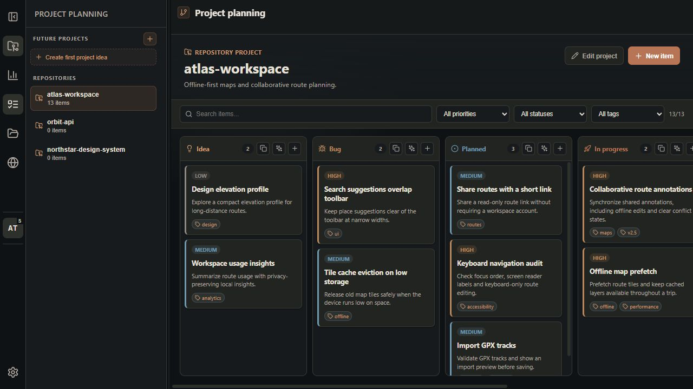

### General settings

Search settings across categories and configure appearance, Git workflow, commit identity, accounts, AI, security and diagnostics.

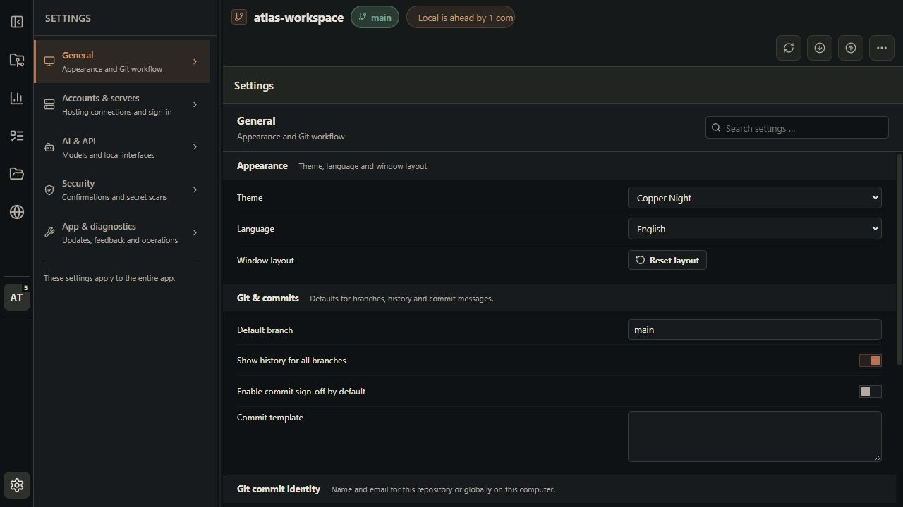

<details>
<summary>More views: coupling, Run, churn, releases, timeline, hosting accounts, publishing and setup</summary>

### A connected view of file coupling

Explore files that change together, highlight a file's partners and inspect the strength of each connection. Zoom, pan and fit the entire network without paging through results.

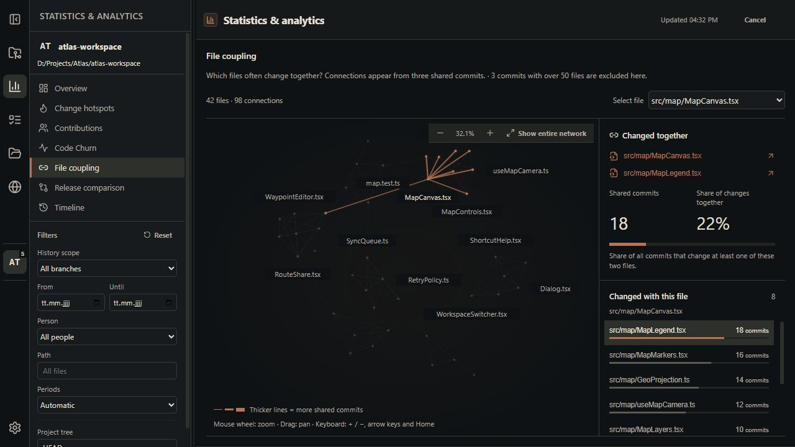

### Run output with useful diagnostics

Read test and build output as a structured transcript, inspect Problems and open referenced files directly in the working-directory editor.

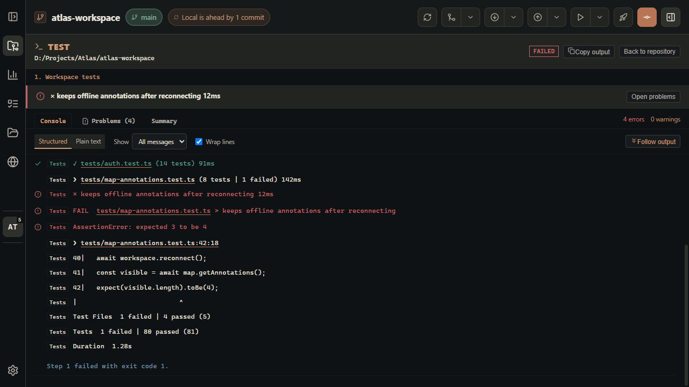

### Code churn over time

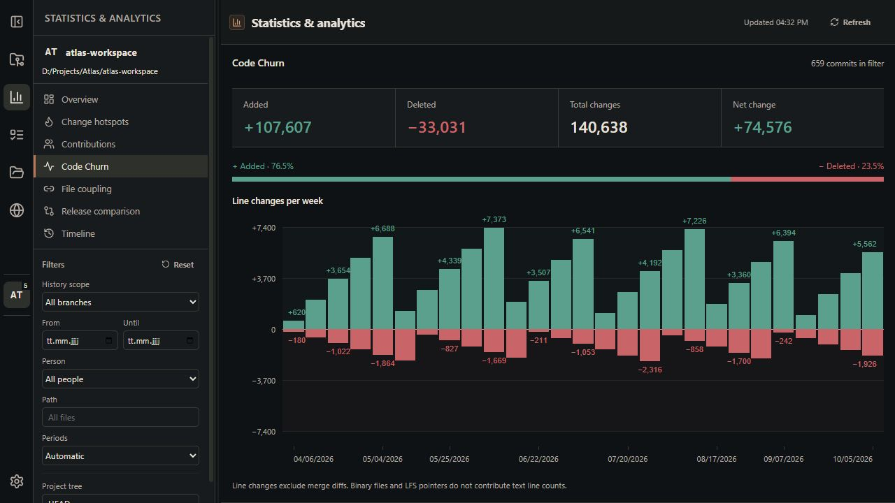

### Statistical release comparisons

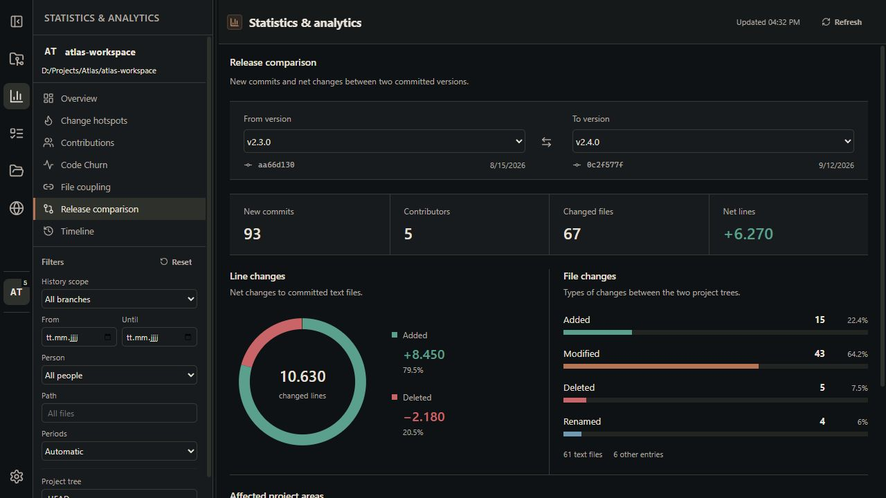

### Timeline playback

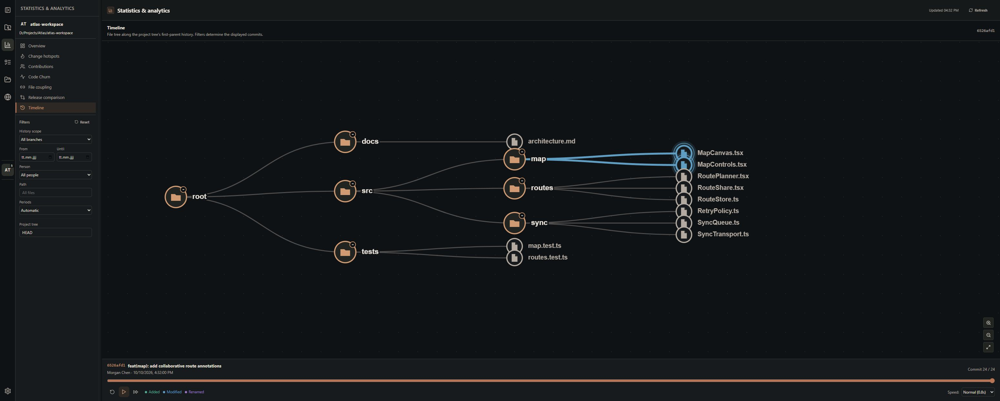

### Hosting and pull requests

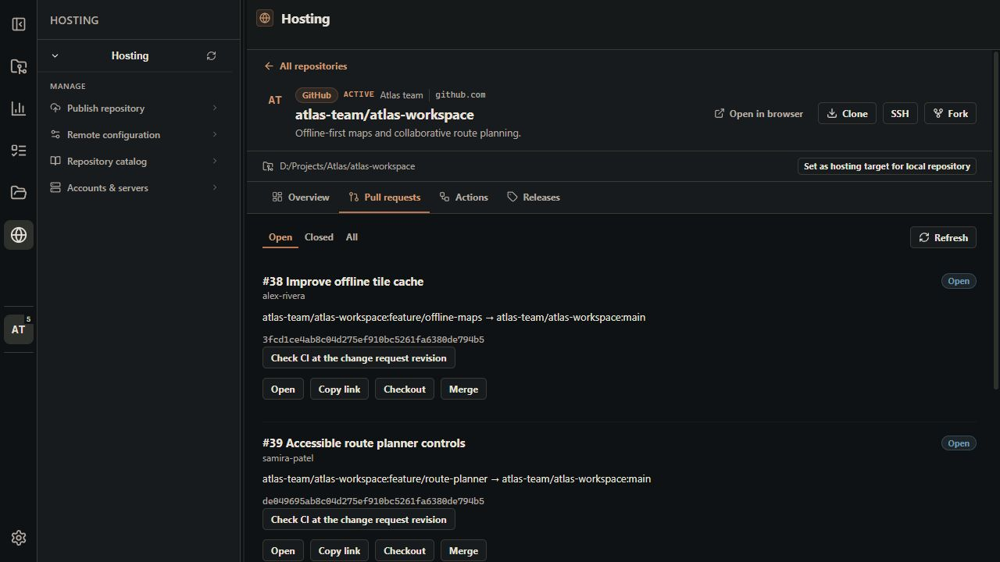

### Hosting accounts and servers

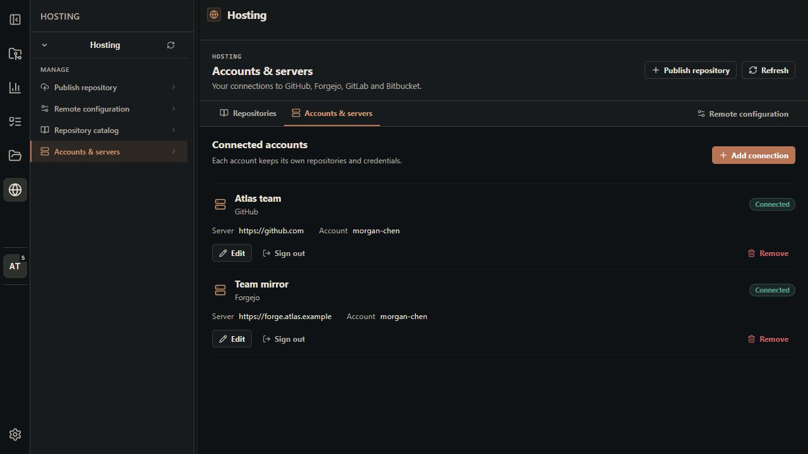

### Publish to a new hosting repository

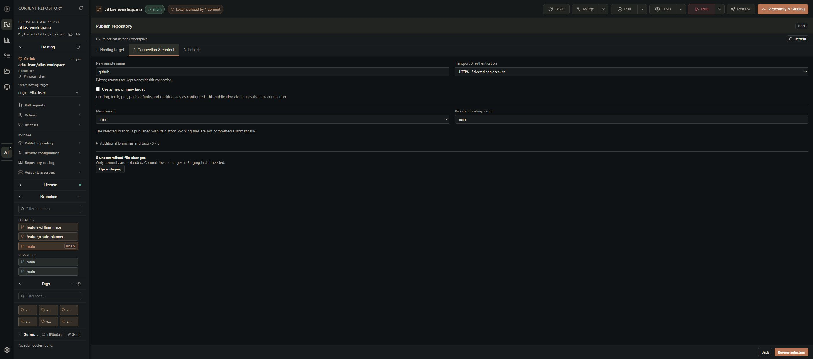

### Independent transfer settings

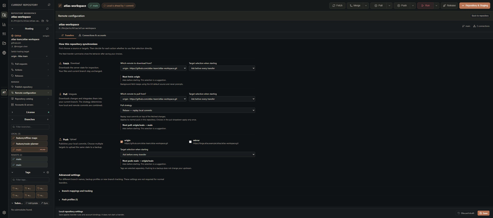

### Required and optional system tools

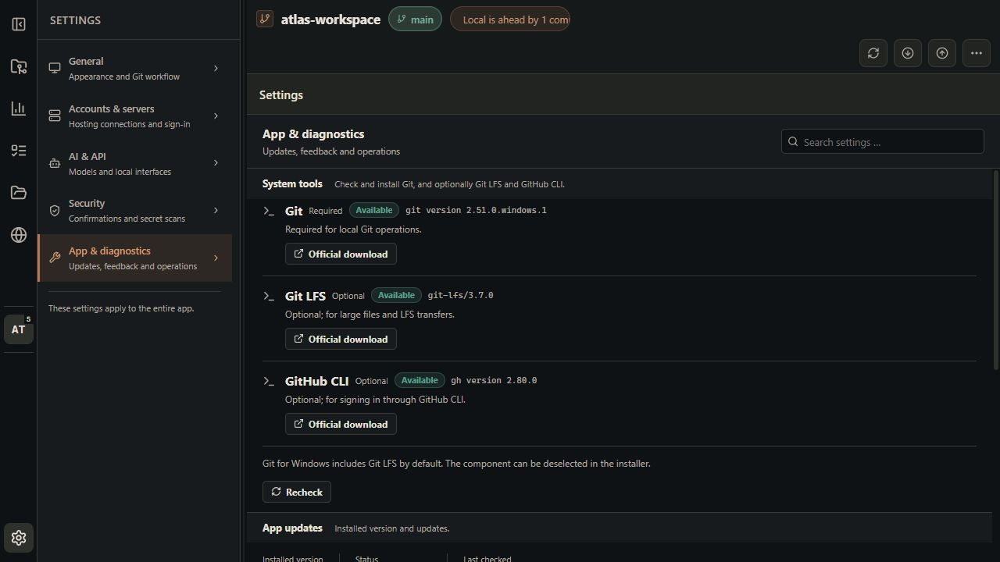

</details>

## Table of Contents

- [Why Open-Git-Control?](#why-open-git-control)
- [Downloads](#downloads)
- [Requirements](#requirements)
- [Screenshots](#screenshots)
- [Feature Reference](#feature-reference)
  - [Statistics & analytics](#statistics--analytics)
  - [Git tools and commit identity](#git-tools-and-commit-identity)
  - [Remote configuration and pull strategy](#remote-configuration-and-pull-strategy)
  - [Guided repository publication](#guided-repository-publication)
- [Typical Workflows](#typical-workflows)
- [Local Planning API and MCP](#local-planning-api-and-mcp)
- [Install Git](#install-git)
- [Repository Run Commands](#repository-run-commands)
- [Development](#development)
- [Release Builds](#release-builds)
- [Data Storage and Security](#data-storage-and-security)
- [Troubleshooting](#troubleshooting)
- [Contributing and Support](#contributing-and-support)
- [License](#license)

## Feature Reference

### Repository and Workspace Management

- Open local repositories and set the active working session.
- Initialize folders that are not yet Git repositories with `git init`, optionally including a starter README and license.
- Keep a persistent repository workspace with recent repositories, favorites, active repository, and sorting.
- Restore stored repositories without an empty-state flash: the active repository is prepared first while the remaining entries are validated in the background.
- Search and sort local repositories by last opened date, name, creation date, ascending, or descending order.
- Recognize repositories by locally discovered icons and logos in the sidebar and repository list. Right-click a repository and choose **Repository logo** to select another image, use initials, or search again. Small thumbnails and preferences are cached locally across restarts; original images and repository configuration stay unchanged.
- Pin repositories, close repositories, and switch between known repositories quickly.
- Recover unavailable repositories with **Select new location** or **Recheck**, preserving repository settings, planning data and the active selection when a project moves.
- Reveal a repository folder directly from Local Repositories or the active repository header.
- Detect an existing `LICENSE`/`LICENCE` file and add or replace a license from bundled, auditable SPDX/Choose a License templates. Required copyright, program-name, program-description, and Apache/GNU notice fields are collected before writing.
- Reset stored layout dimensions from settings.
- Resize the main sidebar and the graph/inspector split.
- Persist collapsed sidebar panels per repository for remotes, branches, tags, and submodules.

### Git tools and commit identity

- Startup checks distinguish available, missing and non-executable Git, Git LFS and GitHub CLI, with their detected versions. A failed Git check opens a dialog once per app session; optional tools do not trigger a startup warning.
- Open **Settings → App & diagnostics → System tools** to recheck, visit official downloads or review a supported installation command. Installation starts only after a user action, uses an existing package manager and the operating system's permission/consent flow, and reports success only after another tool check.
- On Windows, Git for Windows normally supplies LFS. A Git installation rechecks LFS before offering a separate installation; repository-local LFS filters and hooks remain a separate setup step.
- Missing Git pauses Git-dependent work without removing saved repositories. Rechecks after installation, app focus or a manual request resume repository restoration when Git becomes usable. See [system tools](Docs/SYSTEM_TOOLS.md).
- Before committing, missing effective Git name or email opens **Git commit identity**. Existing values are retained; choose **this repository** or **global** scope. Hosting sign-in does not set the commit identity.
- Change name and email later under **Settings → General → Git commit identity**. This configures future commits; existing commits keep their recorded identities. Cancelling setup preserves the commit draft and staged files.

### Branches, Remotes, Tags, and Submodules

- List local and remote branches with search/filtering.
- Create branches, check out local branches, rename branches, and delete branches.
- Force-delete unmerged branches only after an explicit confirmation.
- Create branches from the graph and from selected commits.
- Merge branches from the topbar or context menu with:
  - default merge
  - no-fast-forward merge
  - squash merge
  - fast-forward-only merge
- Select a fetch/pull remote independently of push destinations; fetch prunes stale remote branches.
- Track remote tags separately and preserve existing local tags when their targets differ.
- Auto-fetch on a configurable interval and refresh when the app becomes visible again.
- Show remote health states:
  - no remote configured
  - no tracking branch
  - local ahead
  - remote ahead
  - diverged
  - up to date
  - fetch error
- Add, remove, rename, and update remote URLs.
- Set upstream for the current branch.
- Recover from inaccessible endpoints by inspecting their URLs, accounts and permissions in Remote configuration.
- Create lightweight or annotated tags.
- Search, select, delete, and push tags.
- Show recursive submodule status.
- Run `git submodule update --init --recursive`.
- Run `git submodule sync --recursive`.
- Open submodules in the file system.

### Topbar Git Actions

- Fetch from an explicitly selected remote.
- Merge selected branch with selectable merge mode.
- Normal Pull uses the repository's saved strategy: Git default, Rebase, Merge or Fast-forward only.
- Pull dropdown choices override the strategy for that operation only, including an explicit no-fast-forward merge (`--no-rebase --no-ff`).
- Push directly to an unambiguous or remembered selection of remotes; choose destinations on first use when several remotes exist.
- Configure independent Fetch, Pull and Push selection modes on the repository's Remote configuration page.
- Open **Remote configuration** from either the Pull or Push dropdown.
- Confirm force-with-lease against each destination's inspected revision.
- Set upstream explicitly in Remote configuration.
- Inspect results and retry unsuccessful destinations with the reviewed commit.
- Run repository-specific Run, Test, Format, Start, and Build workflows.
- Open the release creator.
- Open the staging/commit panel.
- Access compact "more actions" variants when the window is narrow.

### Commit Graph and History

- Visual commit graph with branch and merge topology.
- Paged commit loading for larger histories.
- Working tree row above history with staged, unstaged, and untracked counts.
- Async commit statistics with a compact file count and aligned added/deleted line counts.
- Hover or focus a row with hidden or truncated information to see its full title, author, hash, timestamp, refs and available statistics, including in narrow windows.
- Search commits by:
  - all fields
  - subject
  - author
  - hash
  - refs
- Navigate search matches forward/backward.
- Select commits and inspect changed files, commit body, file history, blame, and patch.
- Commit context menu actions:
  - checkout as new branch
  - detached checkout
  - create branch
  - create tag
  - cherry-pick
  - revert
  - revert merge commit with `-m 1`
  - reset `--soft`
  - reset `--mixed`
  - reset `--hard`
  - interactive rebase with editable todo list
  - edit commit message, with history-rewrite checks when needed
  - merge selected ref into current branch
  - copy commit hash
- Tag selection jumps to the tagged commit.

### Statistics & analytics

Open the dedicated **Statistics & analytics** activity tab below **Current repository**, or use the repository menu, local repository context menu or Command Palette. It always follows the active local repository. Its own sidebar holds sections and shared filters; switching repositories stays in Local Repositories or Hosting.

| Section            | What it shows                                                                                                                                   |
| ------------------ | ----------------------------------------------------------------------------------------------------------------------------------------------- |
| Overview           | Commits, contributors, branches, tags, committed files and text lines, activity, language/file-type shares and a hotspot preview                |
| Change hotspots    | A directory-based treemap of frequently changed files; hover for change counts, churn, contributors and recent activity, or open file analysis  |
| Contributions      | A responsive activity calendar, contributions over time and per-person totals, plus **Last changed lines** from Blame with attribution coverage |
| Code Churn         | Added and deleted lines over time, their proportions, total churn and net change                                                                |
| File coupling      | One connected, zoomable network of all matching file pairs, selected partners and connection details, with links to file analysis               |
| Release comparison | Tag/branch/revision selectors and a statistical comparison of new commits, contributors, net file changes, file types and affected areas        |
| Timeline           | Playback of the committed file tree with zoom and pan                                                                                           |

History defaults to all available local and remote branches plus HEAD, counting each reachable commit once. Time, person and path filters are stored per repository. The separately labeled **Project tree** defaults to HEAD and determines file, line and Blame statistics; uncommitted files and staging changes are excluded.

The analysis runs offline and caches results in app data. Reopening shows the last report immediately, then incorporates changed refs and new commits without recalculating unchanged commit diffs. Unchanged background fetches stay quiet; refreshes preserve the current view, release selections, and coupling selection/zoom/layout. Background work supports progress and cancellation through the central notifications.

Counts use `.mailmap` identities and the selected tree's `.gitignore` rules. Analytics intentionally applies these ignore rules to tracked and historical paths as well. Binary files, LFS pointers, symlinks and submodules are identified separately and do not create artificial text-line counts. Shallow history, missing objects and incomplete Blame coverage are reported. Hotspots describe change frequency; **Last changed lines** identifies the latest editor of existing lines. Neither is a measurement of code complexity or ownership.

File coupling normally requires three shared commits; commits touching more than 50 considered files are excluded from coupling only. Release comparison separates newly reachable commits (`A..B`) from the net tree difference between the two revisions and flags non-linear comparisons. See [analytics definitions and cache behavior](Docs/REPOSITORY_ANALYTICS.md).

### Codebase Timeline

- Open **Statistics & analytics → Timeline**; the staging inspector is hidden on this page.
- Reconstructs the first-parent history ending at the selected Project tree, up to the latest 5,000 commits. Analytics filters select playback positions while intervening changes still contribute to the reconstructed tree.
- Canvas-based file tree visualization.
- Zoom and pan with cached tree layouts and frame-coalesced input; playback position, collapsed directories and camera survive view changes.
- Highlights added, modified, deleted, and renamed files.
- Playback controls:
  - play/pause
  - reset to start
  - skip to end
  - timeline slider
  - speed selector from very slow to very fast
- Shows active commit hash, author, date, subject, and current position in the history.

### Forensic Search and Recovery

- Run forensic history searches directly from the graph:
  - string search with `git log -S`
  - regex search with `git log -G`
  - line range search with `git log -L`
- Use path suggestions from the working tree and repository history.
- Inspect result commits and jump into diffs.
- Recovery Center based on reflog:
  - filter reflog entries
  - inspect lost or moved commits
  - create a recovery branch from a reflog entry
  - detached checkout
  - hard reset with explicit danger confirmation

### Staging Area, Stash, and Commits

- Working directory panel with sections for:
  - conflicts
  - staged files
  - unstaged files
  - untracked files
- Search changed files.
- Show staged and unstaged file statistics.
- Stage and unstage individual files.
- Convert selected files or file types to Git LFS through the context menu, with size-based recommendations and safe staging. See [Git LFS in Staging](Docs/GIT_LFS.md).
- Stage all and unstage all.
- Stage all untracked files.
- Discard individual files or all changes.
- Delete untracked files.
- Add files, folders, top-level folders, or file-type patterns to `.gitignore`.
- Stash with optional message.
- Apply, pop, and drop stashes.
- Create a branch from a stash.
- Commit with title and optional description.
- Commit with `--amend`.
- Commit with `--signoff`.
- Enable commit signoff by default in settings.
- Use a configurable commit template.
- Commit with `Ctrl+Enter` in commit fields.
- Manual and AI/grouped commits check the effective Git identity and secret policy before proceeding. Grouped commit execution preserves unrelated or partially staged changes through index snapshots.

### Working Directory and File Viewer

- Switch the right inspector between the Staging Area and a repository-bound Working Directory tree.
- Browse visible files and folders without exposing `.git` or other dot entries; expanded folders stay open while switching views and load lazily.
- File and folder context actions: open, rename, cut, copy, paste, delete, reveal in the system file manager, open externally, or choose an application. Copy/cut/paste stays inside the active repository and destructive actions require confirmation.
- Create files and folders, select multiple entries for batch operations, and add rename prefixes or suffixes.
- Search repository filenames and text content, review matches, and replace text through the working-directory search.
- Open files in the main pane instead of the graph:
  - editable syntax-highlighted text with explicit save and `Ctrl/Cmd+S`
  - Markdown editor and preview
  - safe image and SVG previews
  - sandboxed HTML/HTM preview
  - file History and Blame tabs
  - safe information view for binary or oversized files, with system-open actions
- Working Directory, Staging and commit diffs share one viewer with Text, Diff, Preview, CSV Table, History and Blame. Working Directory starts in Text; changed files and commits start in Diff.
- **Save working file** writes the working-tree file. **Save staging** edits only the selected Git index entry, preserving partial staging, other staged files and the working file. Commit versions are read-only, including tools and CSV cells.
- Previews, relative assets and hashes use the selected source. Missing assets are explained rather than loaded from another version.
- Expand text tools for JSON/JSONC formatting, CSV table editing and copyable content hashes. Read-only commit sources remain read-only in tools and tables.
- Unsaved drafts survive Text/Table/Preview changes. Switching to Diff, another file/source/repository or closing asks to save, discard or cancel. External changes and busy index locks refuse overwrites while keeping the draft.

### Diff Viewer and File Inspector

- Open staged, unstaged, and commit-specific diffs.
- Unified and side-by-side diff modes.
- Syntax-style highlighting for common code tokens.
- Hunk navigation with current hunk counter.
- Hunk actions:
  - stage hunk
  - unstage hunk
  - discard hunk
- Blame overlay inside the diff viewer.
- Click blame entries to navigate to the responsible commit.
- File inspector tabs:
  - History
  - Blame
  - Patch
- File history lists previous commits for the selected file.
- Blame loads in chunks and can load additional 500-line pages.
- Patch tab opens the diff in the main pane.
- Large diff protection:
  - byte and line limits
  - truncated rendering
  - full-copy action where available
- Binary file detection for common binary extensions and Git binary patches.

### Conflict Resolver

- Dedicated conflict resolver view for merge and rebase conflicts.
- Opens automatically when conflicts are detected.
- Shows conflict file list and conflict block navigation.
- Side-by-side current/incoming conflict blocks.
- Resolve one block at a time:
  - accept current
  - accept incoming
  - take both versions
- Resolve all blocks:
  - accept all current
  - accept all incoming
- Manual editor with conflict marker and line-gutter feedback.
- Reload file from disk.
- Save edits.
- Save and mark as resolved.
- Discard changes.
- Continue or abort merge.
- Continue or abort rebase.
- Prevent commits while unresolved conflicts remain.

### Hosting integration

**Publish repository** guides an existing local repository through provider/account selection, remote setup and a secure upload of selected branches and tags. Existing remotes and tracking are preserved by default; interrupted setup can be resumed. See [repository publication](Docs/REPOSITORY_PUBLICATION.md).

The shared **Hosting** area manages several servers and accounts simultaneously. Native Git works with any compatible remote; adapters add catalogs, repository creation, forks, PRs/MRs, CI and publication for GitHub, Forgejo, GitLab, Bitbucket Cloud and Bitbucket Data Center. Capabilities follow the actual provider API and repository permissions. See [Hosting setup, OAuth, endpoint selection and feature differences](Docs/HOSTING.md).

The shared [Remote configuration](#remote-configuration-and-pull-strategy) page keeps Git transfer sources, hosting targets and authentication explicit.

If the installed Git cannot isolate individual push URLs, a normal push publishes all URLs of that named remote as a group. Force, targeted retries and different explicit hosting accounts within such a group require separate named remotes or a Git update.

- Add provider connections in **Hosting → Accounts & servers**, including self-hosted server URLs and installation base paths.
- Sign in with a token or browser OAuth configured for that connection. GitHub also supports Device Flow and importing a CLI login after verifying its account.
- Reconnect to saved accounts, sign out, or remove a connection.
- Search and page repository catalogs, refresh them, and see matching local clones.
- Clone a catalog repository with the selected account and progress feedback, or clone a Git URL directly.
- Create or fork a repository where the provider supports it and connect it with an explicitly named local remote.
- Bind each actual fetch/push URL to its hosting account. For SSH aliases, enter a repository web URL to resolve the identity while keeping the SSH remote URL.
- Choose the bound hosting account or existing system/SSH credentials separately for Git authentication at each endpoint.

### Remote configuration and pull strategy

- Open **Remote configuration** from the repository sidebar, action menu or the bottom of the Pull/Push dropdowns. The guided Transfers page explains download, integration and upload separately, with a preview of the next transfer before saving.
- Choose independent Fetch and Pull sources, one hosting target and one or more Push destinations. Use a single/remembered selection directly or ask every time, separately for each action. Connections & accounts manages endpoint URLs and account bindings.
- Save **Git default**, **Rebase**, **Merge** or **Fast-forward only** as the repository's Pull strategy. Git default shows the effective Git configuration and remains the default for existing repositories. All normal Pull entry points use this preference; explicit dropdown modes apply once.
- Failed Pull retries retain their original source, branch and strategy. Push profiles can send the same reviewed commit to a primary server and backup while retaining existing upstream tracking and multiple push URLs. Per-target results distinguish success from failure; retry addresses unsuccessful destinations.
- Advanced branch mappings, push profiles and upstream settings stay available without requiring them for a normal transfer. Saving configuration does not start a transfer.

### Guided repository publication

**Publish repository** is shared by the local sidebar, repository/action/context menus, Remote configuration, Hosting and Command Palette. The full-width page keeps the local sidebar and protects unsaved editor changes.

1. **Hosting target:** select provider, server, account and personal/organization/namespace/workspace/project target. The local folder suggests the name; visibility defaults to private.
2. **Connection & content:** choose an unused remote name, HTTPS with the selected app account or SSH/system credentials, and the main branch. Additional branches and tags are opt-in. Existing remotes and tracking remain configured unless **Use as new primary target** is explicitly selected.
3. **Publish:** review the captured commit state and choose **Create and publish**. The app creates an empty hosting repository, connects the new remote, and uploads through the shared secret-scan/LFS/credential workflow. After a verified upload it completes default-branch and requested tracking setup.

GitHub and Forgejo support personal or organization targets; GitLab supports namespaces and groups/subgroups; Bitbucket Cloud requires a workspace and selected project, while Data Center uses an existing project. Availability follows provider permissions. An existing repository with the same name is not silently adopted.

Uncommitted files are shown but not committed automatically. Without a commit, **Create and connect** remains available, followed by Staging and continuation after the first commit. Detached HEAD requires choosing or creating a branch. Session drafts are separated by repository and account; completed setup steps are saved locally without credentials, so a failed upload or final setup can resume at the created repository without creating it twice. See [publication and recovery](Docs/REPOSITORY_PUBLICATION.md).

### Pull Requests, CI, and Workflows

- PR/MR lists and checks use the explicitly selected hosting target and account.
- Filter requests by state, create them with explicit source and target repositories/branches, and open or copy their URLs.
- Check out a request locally and merge with methods supported by the repository: merge commit, squash or rebase.
- View GitHub/Forgejo Actions, GitLab Pipelines, Bitbucket Cloud Pipelines, or Data Center build statuses.
- Inspect jobs/steps, bounded logs and artifacts; start, cancel or retry runs where the provider API and permissions support them.
- Unsupported CI actions display their availability and link to the provider website where appropriate.

### Release Creator

- Shared full-width release creator from the repository topbar, action menu and command palette, or **Create release** in Hosting. The local sidebar stays visible; the creator includes its own commit history.
- Session-only drafts are separated by local repository and complete hosting identity. Opening or leaving the creator does not publish anything.
- Edit Markdown notes with a preview; failed upload or final local-tag setup can be retried without publishing the release again.
- Reads release context from the explicitly selected endpoint:
  - repository URL
  - existing tags
  - latest release tag
  - commits from an optional starting tag/ref for release notes
  - target branch or commit
- Suggests the next semantic version tag.
- Choose version bump:
  - major
  - minor
  - patch
- Configure:
  - tag name
  - release name
  - target commitish
  - release body in Markdown
  - draft flag
  - prerelease flag
- Generate release notes with AI.
- Use **Generate notes from template** for German/English patch, minor or major text and an automatically grouped commit list, including commit descriptions. Generation requires neither AI nor network access; when hosting context is unavailable, it reads local Git history (up to 400 commits). An explicit notes baseline limits that history; otherwise no previous publication is assumed.
- Commit descriptions also inform AI generation. Empty Breaking Changes sections and placeholders such as “None” are omitted; actual migration guidance is retained.
- Tune AI notes:
  - language English/German
  - exclude merge commits
  - group into sections
  - more technical details
  - breaking changes section
  - append automatic commit list
  - show commit hashes
- Publish native releases on GitHub, Forgejo and GitLab; manage Tags & Downloads on Bitbucket Cloud, and tags/local notes on Data Center. Draft and prerelease options appear only where supported.

### Project Planning

- Planning view for repository-backed projects and future projects.
- Repository planning data is versioned in `.Open-Git-Control/planning.json`. The file contains no machine-specific paths, so every checkout of a repository reads and writes the same content and the file can be committed and shared with a team.
- Planning data that changes outside the app (for example through a pull, a checkout, or a branch switch) is picked up automatically without restarting the app.
- Board columns:
  - Idea
  - Bug
  - Planned
  - In progress
  - Blocked
  - Done
- Planning items support:
  - title
  - description
  - priority
  - status
  - tags
- Filter planning items by search, priority, status, and tag.
- Create, edit, move, and delete planning items.
- Create future projects without a Git repository.
- Edit or delete projects.
- Materialize a future project by selecting a parent directory, creating a project folder, running `git init`, and keeping the planning project linked.
- Repository removal can also remove linked planning items after confirmation.
- Context menus on planning items offer quick status/priority changes, delete, agent-prompt copy, and (for repository projects) AI commit-message generation.
- Copy an agent-ready implementation prompt for one item or every currently visible item in a status column. Column prompts keep the visible order sorted by priority.
- Generate an AI commit message from one item or a visible status column. The result is saved as the repository commit draft and opens the staging view.

### Local Planning API and MCP capabilities

- Local HTTP server bound to `127.0.0.1`.
- Preferred port: `2990`; if occupied, the app uses the next available local port.
- API docs: `http://127.0.0.1:2990/api/`
- OpenAPI JSON: `/api/openapi.json`
- MCP JSON-RPC endpoint: `/mcp`
- REST wrapper for MCP-style tools:
  - `GET /api/mcp/tools`
  - `POST /api/mcp/tools/call`
- All data and MCP endpoints require a token.
- Public health and docs endpoints are available without protected data.
- Token can be sent as:
  - `x-open-git-control-token: <TOKEN>`
  - `Authorization: Bearer <TOKEN>`
- Settings show:
  - API status
  - host
  - port
  - base URL
  - API docs URL
  - OpenAPI URL
  - MCP URL
  - token header
  - current token
  - token source
  - token expiry
- Generate persistent API tokens for:
  - 1 day
  - 1 month
  - 1 year
  - forever
- Persistent API tokens are stored with Electron `safeStorage` when OS encryption is available.
- Temporary session tokens are used when no persistent token exists.
- Environment controls:
  - `OPEN_GIT_CONTROL_API_PORT=2990`
  - `OPEN_GIT_CONTROL_API_DISABLED=true`
  - `OPEN_GIT_CONTROL_API_TOKEN=<TOKEN>`
- REST planning endpoints include:
  - `GET /api/health`
  - `GET /api/projects`
  - `POST /api/projects`
  - `GET/PATCH/DELETE /api/projects/:projectId`
  - `GET/POST /api/projects/:projectId/todos`
  - `GET /api/repositories`
  - `POST /api/repositories/ensure`
  - `GET /api/repositories/todos`
  - `GET/POST /api/todos`
  - `GET /api/todos/next`
  - `GET/PATCH/DELETE /api/todos/:todoId`
  - `POST /api/todos/:todoId/move`
  - `GET /api/tabs`
  - `GET/POST /api/tabs/:tab/todos`
  - `GET /api/agent/next`
- MCP-style tools:
  - `list_tabs`
  - `list_projects`
  - `list_repositories`
  - `list_todos`
  - `get_next_todos`
  - `create_project`
  - `ensure_repository_project`
  - `create_todo`
  - `update_todo`
  - `move_todo`
  - `delete_todo`
- Git and hosting operations are deliberately not exposed through the local API or MCP surface.

### AI Assistance

- Providers:
  - Ollama
  - Google Gemini
  - OpenAI
- Configure Ollama base URL.
- Store, replace, and remove Gemini API key securely when OS encryption is available.
- Test provider connection.
- Load available models.
- Select or type a model manually.
- Configure commit-message style:
  - Conventional Commits
  - plain
  - detailed
- Configure AI output language for commit messages and planner prompts:
  - auto
  - German
  - English
- Generate an AI commit message from user notes or repository-backed planner items.
- Copy status-aware AI agent prompts for planner implementation, bug fixing, continuation, unblocking, or completion review.
- AI auto-commit:
  - analyzes the working tree
  - groups changed files logically
  - creates commit messages
  - commits groups automatically
  - reports phases such as snapshot, grouping, committing, retry, fallback, done, failed, and cancelled
  - can be cancelled
- AI release notes from commit history and release context.

### Security and Safety

- Optional confirmation prompts for dangerous Git operations.
- Explicit danger confirmations for destructive reset, discard, delete, force-delete, and similar actions.
- Git command policy limits what the renderer can ask the main process to run.
- External link policy opens allowed URLs through the main process.
- Diff preview policy normalizes safe diff commands.
- Secret scan before commit and push:
  - scans staged diffs locally before a commit
  - freshly checks each selected push endpoint and scans only commits missing from that destination, including every intermediate commit where a secret may have been added and later removed
  - handles multiple endpoints, selected branches/tags and force-push plans, checking shared commits only once within a scan
  - skips history scanning when no commits are new; if the remote base is unclear, falls back to a full scan and explains why
  - reports progress against the actual scan scope
  - supports cancellation
  - reports findings with rule, severity, file, line, and sanitized context
  - uses app-native dialogs to cancel, continue, or add affected files to the allowlist
  - formats GitHub Push Protection rejections into an actionable dialog with the relevant links and remediation guidance
- Secret scan strictness:
  - low
  - medium
  - high
- Repository secret-scan allowlist: `.Open-Git-Control/secret-scan-allowlist.txt`
  - open **Secret-scan allowlist** from the repository menu, local repository context menu, Command Palette, or scan dialog
  - saved working-tree rules apply immediately to commit, push and AI auto-commit scans; staging or committing the file is not required
  - **Allowlist files and commit** stages the entire updated allowlist, rescans the index, and includes it in the same commit; failed staging stops the commit
  - saving in the editor or allowlisting during push does not stage or commit the file; commit it normally to share those changes with the team
  - missing files mean no exceptions; reads do not create the file
  - saves detect concurrent edits; policy changes invalidate existing scan approvals
  - **Allowlist files** appends repository-relative paths and runs a new scan before continuing
  - legacy settings migrate only provably matching `path:` rules to already known repositories; existing repository policies remain untouched
  - general text, regex and unassignable legacy rules are omitted; unavailable known repositories are retried when opened
  - rule formats (one per line, UTF-8, maximum 256 KiB): `path:...`, `regex:...`, plain text, or comment lines with `#`
- Hosting credentials, AI keys and persistent Planning API tokens are stored OS-encrypted through Electron `safeStorage` when available.
- If OS encryption is unavailable, secrets are not stored persistently.

### Settings, Updates, and Job Center

- Settings use five categories with a shared, compact layout: **General**, **Accounts & servers**, **AI & API**, **Security**, and **App & diagnostics**.
- **Search settings** finds groups across all categories and opens the matching section. Clearing a search preserves pending field drafts.
- Only the settings content scrolls; the heading and search remain visible. Narrow windows also provide a category selector.
- API references, request examples, and update release notes expand on demand.
- Disabled actions explain the missing prerequisite and link to its setup, such as a connection's OAuth Client ID. Git errors add a short explanation and a relevant action (sign in, install Git, recheck connection or open conflicts), while technical output remains expandable.
- General settings:
  - theme
  - language
  - default branch
  - layout reset
  - secondary history
  - commit signoff default
  - commit template
  - repository/global Git commit identity
  - auto-fetch interval
- Themes:
  - Copper Night
  - Midnight Teal
  - Graphite Blue
  - Forest Copper
  - Porcelain Light
  - Ember Slate
  - Arctic Mint
  - Mono Dark Red
  - Mono Light Red
  - Mono Dark Green
  - Mono Light Green
- Accounts & servers:
  - hosting accounts, server/API URLs, tokens and per-connection OAuth configuration
- AI & API settings:
  - AI provider
  - AI model
  - AI message style/language
  - Ollama URL
  - Gemini API key
  - OpenAI API key and HTTPS base URL
  - runtime API status
  - copyable URLs and token values
  - token generation and deletion
  - example cURL commands
  - example MCP server config
- Security settings:
  - dangerous operation confirmations
  - secret scan before commit
  - secret scan before push
  - strictness
  - repository allowlists are configured on the repository's **Secret-scan allowlist** subpage
- App & diagnostics:
  - required Git and optional Git LFS/GitHub CLI status, versions, rechecks, official downloads and reviewed installation actions
  - installed app version
  - updater status
  - available version
  - download progress
  - background update toggle
  - one-click update
  - release notes
  - copyable, redacted diagnostics report
  - job center
- Run settings:
  - per-repository `.Open-Git-Control/run.json` configuration
  - platform-specific shell commands and ordered workflow steps
  - recognised command templates and output parser selection
- Job Center tracks recent operations such as:
  - clone
  - fetch
  - pull
  - push
  - stage
  - commit
  - stash branch
  - secret scan
  - AI auto-commit

### Shortcuts and Productivity

- `Ctrl/Cmd+1..6`: Local Repositories, Current repository, Hosting, Settings, Todos and Statistics & analytics, respectively
- `Ctrl+Shift+F`: fetch
- `Ctrl+Shift+P`: command palette
- `Ctrl+Shift+T`: create a todo for the active repository
- `Ctrl+Enter`: commit from commit fields
- Command palette with keyboard navigation, search, `Enter` to run, and `Esc` to close
- Copy buttons for hashes, URLs, tokens, API examples, and PR links
- Virtualized lists for larger file and commit detail views

## Typical Workflows

### Open or initialize a repository

1. Open the Local Repositories tab.
2. Choose a folder.
3. If it is not a Git repository yet, confirm initialization.
4. Switch to the Repository tab and start working.

### Standard local Git workflow

1. Use Fetch or Pull from the topbar. A single or remembered source starts directly; otherwise choose the source and whether to remember it.
2. Create or switch a branch.
3. Review changed files in the working directory.
4. Open diffs, stage files or hunks, and optionally stash work.
5. Create a commit with title and description. If name or email is missing, configure the Git identity for this repository or globally in the dialog.
6. Use Push to publish the current branch directly to the single or remembered destination selection. Choose targets on first use with several remotes. Use the separate tag action to publish tags; Force and secret findings still require approval. Set upstream separately if needed.
7. Inspect each destination's result; retry unsuccessful targets against the reviewed revision.

### Publish an existing local repository

1. Open **Publish repository** for the active local repository and select the connected hosting account and creation target.
2. Review the private repository name, new remote, main branch and any additional branches/tags. Commit working changes in Staging first if they belong in the upload.
3. Choose **Create and publish**, review secret findings if any, and follow the per-step progress.
4. Open the resulting repository link. If upload or final setup fails, resume the pending step on the same created repository.

### Explore repository statistics

1. Activate a local repository, then open **Statistics & analytics** in the activity bar.
2. Use the sidebar's history/time/person/path filters and choose the committed Project tree separately.
3. Explore hotspots or the coupling network, click a file for analysis, or compare two tags from the release dropdowns.
4. Open Timeline to replay the committed file tree. Reopening analytics reuses the cached report.

### Resolve conflicts

1. Start a merge, pull, rebase, cherry-pick, or other operation that produces conflicts.
2. Open the Conflict Resolver when it appears.
3. Resolve each block by choosing current, incoming, or both.
4. Use the manual editor when the result needs fine-tuning.
5. Save and mark files as resolved.
6. Continue or abort merge/rebase from the resolver.

### Hosting pull / merge request flow

1. Add the provider account in Hosting → Accounts & servers and sign in with a token or its configured browser login.
2. Select the hosting account and endpoint under Remote configuration.
3. Open PR / MR from the repo sidebar and choose the explicit source and target repositories.
4. Inspect request checks and the provider's CI view.
5. Open, copy or check out the request; merge with an available method after reviewing its head commit.

### Release flow

1. Open **Release** in the repository topbar, or **Create release** in Hosting. Hosting first activates a selected local clone; repositories without a clone offer clone/open actions.
2. The creator uses the configured publication target, or lets you choose among multiple endpoints. Missing accounts or mappings have configuration links.
3. Start with the current branch and a Patch suggestion. Adjust the version, target branch/tag/commit, optional notes baseline, Markdown notes and AI options; select assets before publishing.
4. **Create release** checks the endpoint. When commits are missing, choose **Push and create release**, **Create without pushing** (where available), or cancel. The confirmed push publishes the captured release branch only to this endpoint, even when another branch is checked out. It leaves backup targets and upstream settings unchanged and repeats the endpoint check before creating the release.
5. Draft, prerelease and asset options appear only where supported. Uploaded and pending files remain visible after an upload failure; retry sends only pending files.
6. Completion creates the local tag at the verified published commit, refreshes the release history, and opens a fresh draft with the next patch version. Notes, selected assets, and publication flags are cleared; note preferences stay available. Existing local tags are preserved. If the local tag cannot be created, retry that step after resolving the lock or conflict without publishing the release again.
7. For Bitbucket Cloud, use tags and separate Downloads; for Data Center, use tags and copy/save local notes. All providers share the same creator and AI options.

### Recovery flow

1. Open Recovery Center in the graph area.
2. Filter reflog entries.
3. Create a recovery branch from the relevant entry.
4. Use detached checkout or hard reset only when you are sure.

### Agent planning workflow

1. Start Open-Git-Control.
2. Open Settings -> AI & API, expand **URLs and access**, and copy the MCP URL plus token.
3. Configure an external agent with the MCP URL or REST endpoints.
4. Ask the agent for `get_next_todos` or `GET /api/agent/next`.
5. Let the agent create or move planning items.
6. Keep Git and hosting operations inside the desktop app.

## Local Planning API and MCP

Example: get next todos for a repository.

```bash
curl "http://127.0.0.1:2990/api/agent/next?repoPath=<REPO_PATH_URL_ENCODED>&limit=10" \
  -H "x-open-git-control-token: <TOKEN>"
```

Example: list MCP-style tools over JSON-RPC.

```bash
curl -X POST "http://127.0.0.1:2990/mcp" \
  -H "x-open-git-control-token: <TOKEN>" \
  -H "content-type: application/json" \
  -d "{\"jsonrpc\":\"2.0\",\"id\":1,\"method\":\"tools/list\"}"
```

Example MCP server config:

```json
{
  "mcpServers": {
    "open-git-control": {
      "type": "http",
      "url": "http://127.0.0.1:2990/mcp",
      "headers": {
        "x-open-git-control-token": "<TOKEN>"
      }
    }
  }
}
```

## Install Git

The startup dialog and **Settings → App & diagnostics → System tools** provide official downloads and, where supported, installation through an existing package manager. Choose **Recheck** after installing; Git-dependent work resumes when the tool is usable. The manual options below remain available. See [tool detection and installation](Docs/SYSTEM_TOOLS.md).

### Windows

1. Download Git from [git-scm.com/downloads](https://git-scm.com/downloads).
2. Run the Windows installer.
3. Keep "Git from the command line" enabled.
4. Use **Recheck** in the app. Restart the app only if the new installation still cannot be detected.

### macOS

Homebrew:

```bash
brew install git
```

Apple Command Line Tools:

```bash
xcode-select --install
```

### Linux

Debian/Ubuntu:

```bash
sudo apt update && sudo apt install git -y
```

Fedora:

```bash
sudo dnf install git -y
```

Arch:

```bash
sudo pacman -S git
```

### Verify Git

```bash
git --version
```

Set your name and email through **Settings → General → Git commit identity**, selecting repository or global scope. The equivalent global Git commands are:

```bash
git config --global user.name "Your Name"
git config --global user.email "your@email.com"
```

## Repository run commands

The **Run** menu in the top bar can run repository-specific **Run**, **Test**, **Format**, **Start**, and **Build** commands. Configuration is versioned in `.Open-Git-Control/run.json`; commands execute only after an explicit click and always use the repository root as their working directory.

```json
{
  "version": 1,
  "actions": {
    "test": {
      "steps": [
        {
          "id": "unit-tests",
          "label": "Unit tests",
          "parser": "vitest-jest",
          "windows": { "shell": "powershell", "command": "npm test" },
          "macos": { "shell": "zsh", "command": "npm test" },
          "linux": { "shell": "bash", "command": "npm test" }
        }
      ]
    }
  }
}
```

Use **Settings -> Run** to edit the five fixed actions, select recognised templates, and configure ordered workflows. Templates cover npm, pnpm, Yarn, Bun, Python, Rust, Go, .NET, Maven, Gradle, Flutter, and CMake projects. Each step can use PowerShell or CMD on Windows, zsh on macOS, and bash on Linux.

File references in the console, expanded technical details and **Problems** open the current working file in the app editor at the reported line and column. Relative references resolve from the run's working directory; absolute paths and local file URLs must belong to the same repository. Opening a file keeps the run alive and uses the existing unsaved-editor navigation protection.

The **Run console** defaults to a structured transcript: terminal colour/cursor controls and OSC sequences are removed, repeated warnings and watcher/progress messages are grouped, and stack traces and package-manager follow-up failures expand as details. Message severity comes from the content, so ordinary stderr information is not shown as an error. **Plain text** and **Copy output** retain the complete captured, cleaned transcript (within the existing 4,000-line/2 MiB capture limits). Filters, line wrapping and automatic following remain available; scrolling up pauses following. Known npm/pnpm, Node.js, Vite and Cargo problems are detected even without a custom parser. Port conflicts, unsupported Node.js versions, missing commands and missing dependencies include suggested next steps. PowerShell runs explicitly use UTF-8 output; no project command is changed or restarted automatically.

Only one workflow runs at a time. It can continue in the background, be reopened from the Run menu, and be stopped from the app. The console keeps a bounded raw-output buffer, a parsed Problems tab, a Summary tab, and copy actions for both output and problems. An unread successful result turns the Run button green; an unread failed result turns it red until opened.

## Development

Install dependencies:

```bash
npm install
```

Run Vite and Electron in development:

```bash
npm run dev
```

Build the application:

```bash
npm run build
```

Run tests:

```bash
npm run test
npm run test:coverage
npm run test:ci
```

Available scripts:

| Script                   | Purpose                                                  |
| ------------------------ | -------------------------------------------------------- |
| `npm run dev`            | Run Vite and Electron together                           |
| `npm run electron:dev`   | Build Electron process and start Electron against Vite   |
| `npm run build`          | TypeScript, Vite build, and Electron process build       |
| `npm run build:electron` | Compile Electron main/preload process                    |
| `npm run legal:prepare`  | Generate installer license and third-party notices       |
| `npm run legal:check`    | Verify generated legal files are current                 |
| `npm run dist`           | Build packaged app for the current platform              |
| `npm run dist:win`       | Build Windows NSIS x64 package                           |
| `npm run dist:linux`     | Build Linux AppImage and deb packages                    |
| `npm run dist:mac`       | Build macOS dmg and zip packages                         |
| `npm run release:win`    | Build unsigned Windows release assets without publishing |
| `npm run release:linux`  | Build Linux release assets without publishing            |
| `npm run release:mac`    | Build unsigned macOS release assets without publishing   |
| `npm run preview`        | Preview Vite build                                       |
| `npm run electron:start` | Start Electron after the Electron process has been built |
| `npm run test`           | Run unit tests                                           |
| `npm run test:coverage`  | Run tests with coverage                                  |
| `npm run test:ci`        | Compile, test with coverage, and build                   |

## Release Builds

Local package artifacts are written to `release/`.

```bash
npm run dist
npm run dist:win
npm run dist:linux
npm run dist:mac
```

GitHub publishing is handled by [.github/workflows/release.yml](.github/workflows/release.yml). Publishing a release with a tag such as `vX.Y.Z` in Open Git Control or on GitHub triggers quality gates and platform builds for Windows, Linux, and macOS. The workflow derives the package and lockfile version from the release tag, generates legal notices, validates the packaged applications and updater metadata, and generates `SHA256SUMS.txt`. It then attaches all assets to the already published release and verifies them remotely. The workflow can also be started manually for an existing release tag to retry failed builds.

Local `dist:*` builds use the version committed in `package.json`. Official release builds run `prepare-release-version.js` so `package.json`, `package-lock.json`, the packaged app version, and MCP server metadata all resolve to the release tag version.

No custom repository secrets or signing certificates are required. GitHub supplies the workflow's `GITHUB_TOKEN` automatically. Windows and macOS packages are intentionally unsigned and the macOS build is not notarized, so operating systems can show SmartScreen or Gatekeeper warnings. Code signing and notarization can be added later without changing the release trigger.

Expected release assets:

- `Open-Git-Control-<version>-win-x64.exe`
- `Open-Git-Control-<version>-linux-x86_64.AppImage`
- `Open-Git-Control-<version>-linux-amd64.deb`
- `Open-Git-Control-<version>-mac-x64.dmg`
- `Open-Git-Control-<version>-mac-x64.zip`
- updater metadata such as `latest.yml`, `latest-linux.yml`, `latest-mac.yml`, and blockmaps
- `SHA256SUMS.txt` for manually downloaded installers and archives
- bundled `LICENSE` and `THIRD_PARTY_NOTICES.txt` resources

## Data Storage and Security

- Git commands operate on the selected local repository.
- Repository workspace state is stored in the Electron user-data directory.
- Settings are stored locally.
- Repository planning, run configuration and secret-scan allowlists live in `.Open-Git-Control/planning.json`, `run.json` and `secret-scan-allowlist.txt`; commit them to share them with your team. Future planning projects remain in app data.
- Analytics caches live exclusively in app data, storing metadata, counts and aggregates rather than full file/patch contents. Analysis does not check out files or change the index.
- Repository publication recovery records are stored locally without credentials.
- The Planning API binds to `127.0.0.1`.
- Planning API token-protected endpoints are intended for local processes on the same machine.
- Hosting credentials, AI keys and persistent Planning API tokens are stored with OS-backed encryption through Electron `safeStorage` when available.
- If OS encryption is unavailable, secrets are not persisted.
- The local API exposes planning data only; it does not expose Git or hosting actions.

## Troubleshooting

### `git` not found

- Open the sidebar warning or **Settings → App & diagnostics → System tools**. Review the failed check, install Git or use the official download, then select **Recheck**.
- Saved repositories stay available and restoration resumes after a successful check. Restart the app only when the installation cannot be picked up by rechecking.
- The same tool page handles optional LFS and GitHub CLI; `git --version` is a useful manual check.

### Commit name or email is missing

- Complete **Git commit identity** when prompted, or open **Settings → General → Git commit identity**. Choose repository or global scope and review the effective values.
- Hosting login credentials do not provide the Git author/committer identity.

### A repository was moved

- Choose **Select new location** for the unavailable repository and select its new folder, or use **Recheck** if the existing location is available again.
- Relocating keeps its settings and planning association; removal is not required.

### GitHub CLI login import does not work

- Install GitHub CLI from [cli.github.com](https://cli.github.com/).
- Verify with `gh --version`.
- Confirm that the CLI is signed in to the configured host and inspect the offered username before importing it.
- Use a token or Device Flow if you do not want to use GitHub CLI.

### Device Flow does not work

- Edit the GitHub connection under Hosting → Accounts & servers and set its OAuth Client ID.
- Enable Device Flow for that OAuth application and complete the displayed code in the browser before it expires.

### No pull / merge requests are visible

- Sign in to the relevant provider account and check repository/change-request permissions.
- Select the intended hosting repository and account in Remote configuration; bind SSH aliases through the repository web URL.
- Refresh the repository and PR/MR view. The Git remote may have any name.

### Commit or push is blocked by secret scan

- Inspect the reported file and line.
- Remove the secret or rotate it if it was committed accidentally.
- Use the dialog's allowlist action only for intentional test or example values; it allowlists the affected file path for future scans.
- Exceptions are saved to `.Open-Git-Control/secret-scan-allowlist.txt` of the current repository. Commit this file to share them. If the file changed externally, reload the editor, review your preserved draft, and save again.
- Add a narrow allowlist rule only for intentional dummy/example values.

### Auto-update is unavailable

- Auto-update only works in installed production builds.
- `npm run dev` and local unpackaged builds do not use the updater.

### Planning API is not on port `2990`

- Another local process may already use the port.
- Check Settings -> AI & API for the actual port.
- Set `OPEN_GIT_CONTROL_API_PORT=<PORT>` before starting the app if you want a different preferred port.

### AI features do not respond

- For Ollama, verify the Ollama server URL and model name.
- For Gemini, store a valid API key and select a supported model.
- Use "Test connection" and "Load models" in Settings -> AI & API.

## Contributing and Support

Open-Git-Control uses structured GitHub forms for bug reports, feature requests, questions, and documentation reports:

[Open a structured issue](https://github.com/timbornemann/Open-Git-Control/issues/new/choose)

- Read [CONTRIBUTING.md](CONTRIBUTING.md) before opening a pull request.
- Use [SUPPORT.md](SUPPORT.md) to choose the right report or question path.
- Report security vulnerabilities privately through [SECURITY.md](SECURITY.md), not in public issues.
- Follow the [Code of Conduct](CODE_OF_CONDUCT.md) when participating in issues, reviews, and pull requests.

Blank issues are disabled so new reports include enough context to be triaged.

## License

Open-Git-Control is licensed under the [GNU General Public License](LICENSE).
